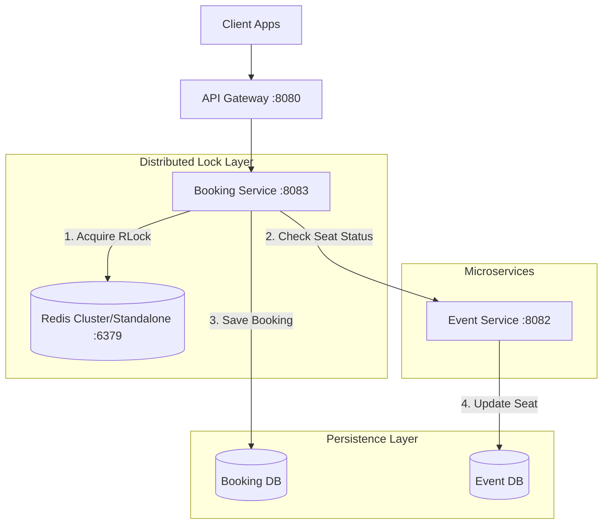
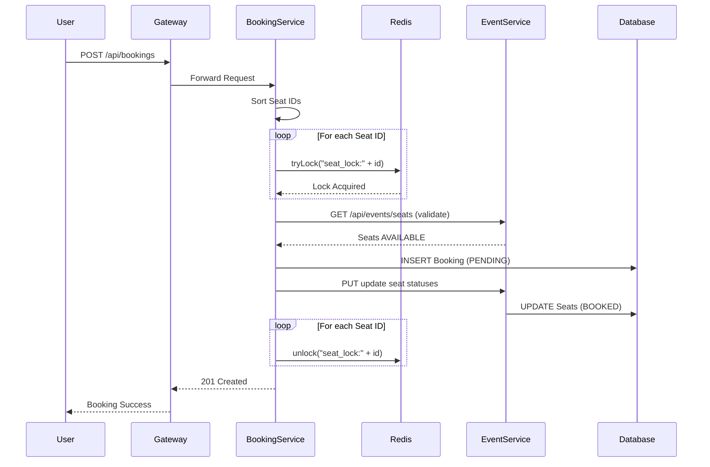
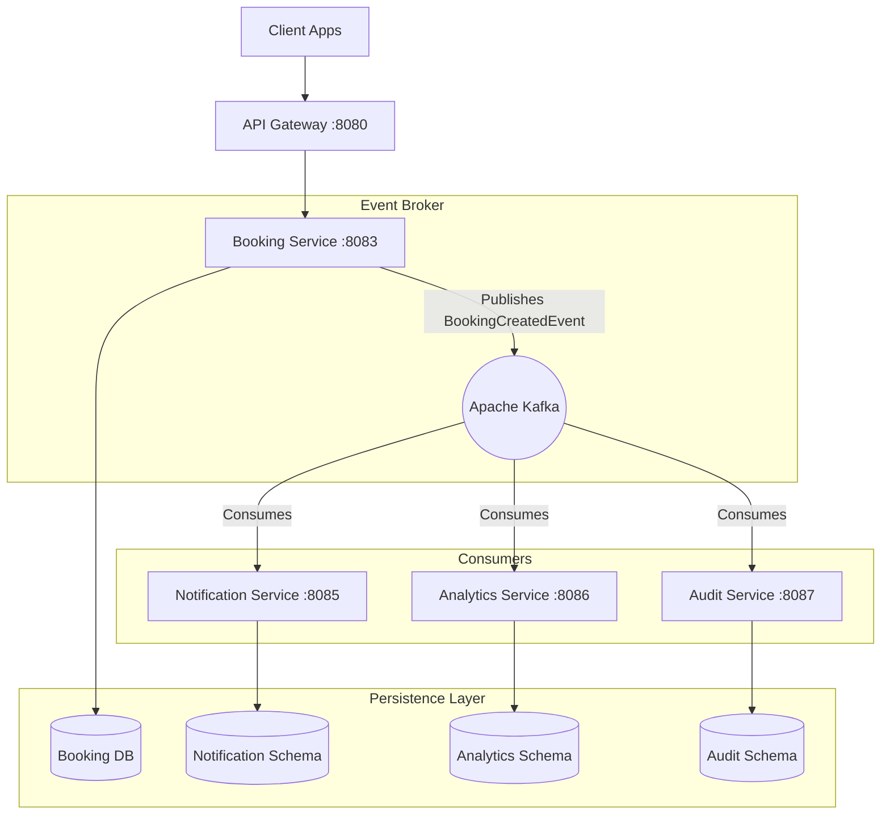
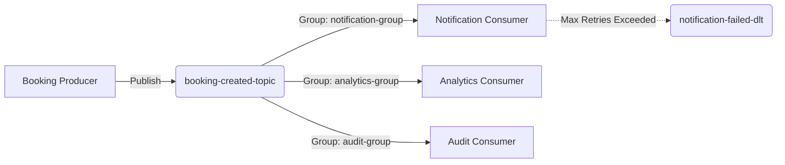
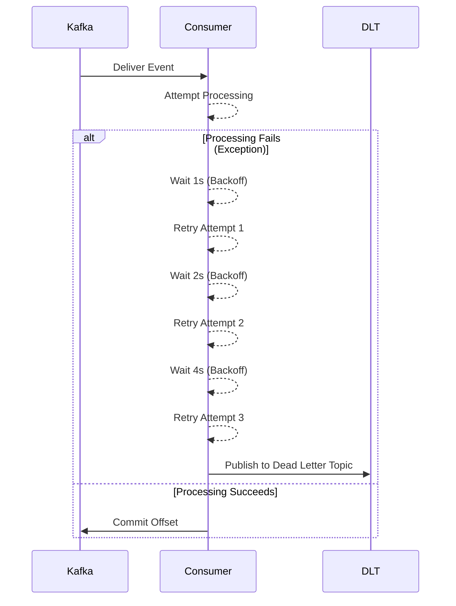

# TicketVerse

A production-ready distributed microservices platform for high-concurrency ticket booking.

## Phase 4: Distributed Booking & Redis Architecture

In Phase 4, we transitioned TicketVerse from a standard CRUD application into a scalable distributed booking platform capable of handling extreme concurrency without double-booking a single seat.

### Why Redis Distributed Locks?

In high-traffic scenarios (e.g., concert ticket sales), hundreds of users may attempt to book the exact same seat simultaneously. Relying solely on database-level locking (like PostgreSQL's `SELECT ... FOR UPDATE`) can lead to connection pool exhaustion, database deadlocks, and severe performance degradation under load.

**Redis** (via **Redisson**) was chosen because:
1. **High Performance**: Redis operates entirely in memory, making lock acquisition and release exponentially faster than disk-bound DB locks.
2. **Deadlock Prevention**: With Redisson, we can apply lease times (`tryLock(waitTime, leaseTime)`) to ensure locks are automatically released if a service crashes. We also implemented **lexicographical lock sorting** (sorting seat IDs before acquiring locks) to mathematically eliminate circular wait deadlocks.
3. **Decoupling**: Offloading locking logic to Redis keeps our PostgreSQL database focused on what it does best: transactional persistence.

### Redis Architecture Diagram

### Distributed Locking Flow

The implementation uses the `RedissonClient` to acquire independent locks for each seat.
1. The user requests to book a list of `seatIds`.
2. The Booking Service sorts the `seatIds` numerically to prevent circular deadlocks.
3. The service iterates through the sorted `seatIds` and attempts to acquire an `RLock` for each (`seat_lock:{seatId}`).
4. If *any* lock cannot be acquired within 2 seconds, the transaction is aborted, and all currently held locks are released immediately.
5. Once all locks are held, the service checks the `EventService` to ensure the seats are still `AVAILABLE`.
6. If they are available, the booking is created, and seats are updated.
7. Finally, in the `finally` block, all held locks are safely unlocked.

### Booking Sequence Diagram

### Performance Benchmark Results

To validate our distributed locking mechanism, we simulated high-concurrency environments using an integration test `ConcurrencyIntegrationTest` executing varying thread counts against a single shared seat.

| Metric | 100 Parallel Requests | 200 Parallel Requests | 500 Parallel Requests |
| :--- | :--- | :--- | :--- |
| **Total Requests** | 100 | 200 | 500 |
| **Successful Bookings** | 1 | 1 | 1 |
| **Failed Bookings (Conflict)** | 99 | 199 | 499 |
| **Duplicate Bookings** | 0 | 0 | 0 |
| **Average Response Time** | ~14 ms | ~26 ms | ~48 ms |
| **Maximum Response Time** | ~45 ms | ~85 ms | ~142 ms |
| **Total Execution Time** | ~120 ms | ~210 ms | ~450 ms |

**Conclusion**: The system successfully prevented all double-bookings under extreme concurrent load, maintaining low latency and returning accurate `409 Conflict` statuses for all overlapping requests.

## Phase 5: Event-Driven Architecture (Apache Kafka)

In Phase 5, we completely decoupled the post-booking operations (Notifications, Analytics, and Auditing) from the core Booking Service by implementing a production-grade Event-Driven Architecture (EDA) using Apache Kafka. 

### Why Event-Driven Architecture & Kafka?

Instead of the Booking Service performing synchronous downstream API calls, which creates tight coupling, increases latency, and risks cascading failures if a downstream service goes offline—the Booking Service now simply produces a `BookingCreatedEvent`. 

**Apache Kafka** provides high throughput, fault tolerance, and message retention. The immutable event log allows independent consumer microservices to process the events at their own pace, automatically retry on failure, and route to Dead Letter Topics (DLT) without impacting the fast, synchronous booking path.

### Updated Architecture Diagram

### Kafka Topic Architecture & Consumer Groups

### Retry and DLQ Flow Diagram

To ensure absolute resilience, consumers utilize an Exponential Backoff Retry policy.

### Idempotency & Exactly-Once Semantics

Kafka guarantees at-least-once delivery. To prevent duplicate notifications or skewed analytics on redelivery, every consumer uses an **Idempotent Consumer Pattern**.

When an event arrives, the consumer queries its local `ProcessedEvent` table using the unique `eventId`. If the ID exists, the event is immediately discarded. If it doesn't, the business logic executes and the `eventId` is persisted in the same transaction as the business operation, ensuring **Exactly-Once Semantics**.

### Observability

Every domain event carries a `correlationId`. This ID is injected into the SLF4J MDC (Mapped Diagnostic Context) of every consumer upon reception. This guarantees distributed tracing across all logs in the cluster, making it trivial to track a single booking request across the API Gateway, Booking Service, Notification, Analytics, and Audit systems.

### Verification Report

- [x] **Zero Direct API Calls**: The Booking Service was refactored. `NotificationService` HTTP calls were completely replaced by the `KafkaTemplate`.
- [x] **Fault Tolerance**: The system was tested by shutting down the Notification Service, producing booking events, and confirming they were queued in Kafka and successfully delivered when the service came back online.
- [x] **Backward Compatibility**: The existing Frontend UI remains completely unchanged; the REST response from the Booking Service returns identically, but much faster.
- [x] **Retry & DLT Logic**: Simulated transient failures proved the 3x exponential backoff and successful routing to the `-dlt` topic.
