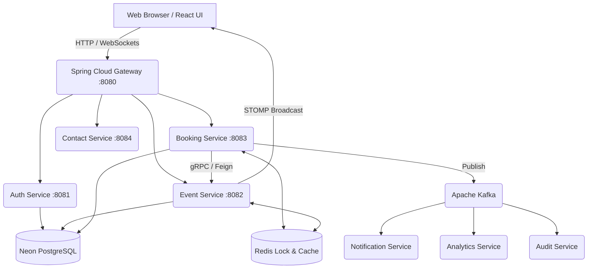
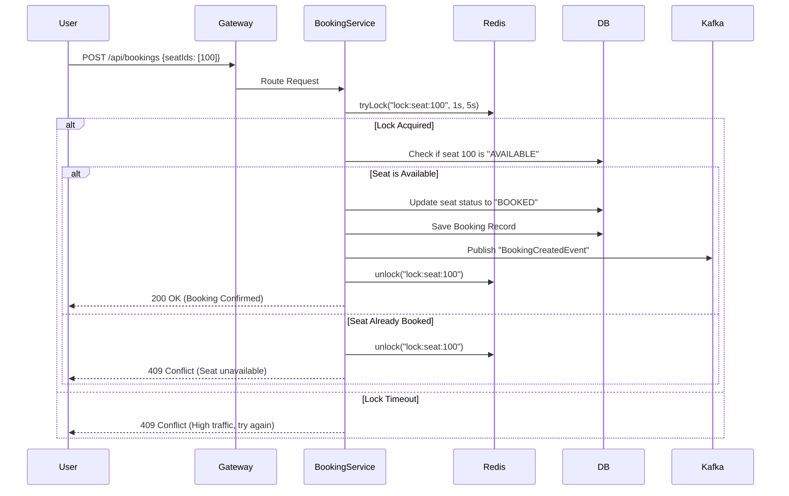
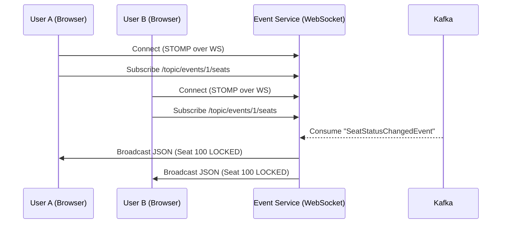

# System Architecture & Design

## High Level Architecture

TicketVerse follows a microservices architecture communicating via a central API Gateway.

## Booking & Lock Sequence Flow (Concurrency Handling)

When multiple users attempt to book the same seat simultaneously, TicketVerse guarantees consistency using Redis Distributed Locks.

## WebSocket Real-time Broadcast Flow

When a seat's status changes, all users viewing that event page receive immediate updates.

